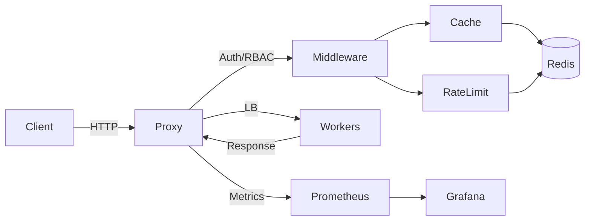

# LLMProxy

▶ [Watch the demo video](#) *(Coming soon)*

LLMProxy sits in front of your LLM backends and handles the infrastructure concerns—authentication, role-based access control, rate limiting, caching, and load balancing—so your application code doesn't have to. It exposes an OpenAI-compatible API so it works as a drop-in proxy layer for any LLM-powered application.

## Features

- **Reverse proxy with connection pooling:** Efficiently manages and reuses TCP connections to backend LLM providers, reducing connection overhead and latency.
- **Semantic caching (Redis, tenant-isolated):** Syntactically hashes incoming prompt structures to serve identical requests from cache, dramatically reducing LLM costs and response times.
- **Token-bucket rate limiting per API key:** Prevents noisy-neighbor scenarios and API abuse by enforcing strict throughput limits on a per-tenant basis.
- **Load balancing:** Distributes traffic across multiple worker backends utilizing round-robin, weighted, or least-connections strategies.
- **Active health checking with automatic failover:** Continuously probes backend health and automatically routes traffic only to healthy nodes to ensure high availability.
- **Prometheus + Grafana observability:** Exposes deep metrics (cache hit/miss rates, token usage, latency distributions) for real-time monitoring and alerting.
- **Docker Compose + Kubernetes ready:** Ships with containerized definitions and K8s manifests for immediate local or production deployment.

## Prerequisites

- [Go 1.25+](https://go.dev/doc/install)
- [Redis 7+](https://redis.io/download/) (if running locally without Docker)
- [Docker & Docker Compose](https://docs.docker.com/get-docker/) (for full local environment)

## Quick Start

```bash
# Option A: Run locally with Make
export API_KEYS_JSON='{"test-key":{"owner":"local","role":"admin"}}'
make build

# Start mock workers in background
make run-worker-1 &
make run-worker-2 &
make run-worker-3 &

# Start the proxy
make run-proxy

# Option B: Docker Compose (add API_KEYS_JSON to docker-compose.yml or .env)
docker-compose up --build -d

# Test it
curl -X POST http://localhost:8080/v1/chat/completions \
  -H "Content-Type: application/json" \
  -H "X-API-Key: test-key" \
  -d '{"model":"gpt-3.5-turbo","messages":[{"role":"user","content":"Hello!"}]}'

# Dashboard
# http://localhost:8080/dashboard

# View metrics
# Prometheus:  http://localhost:9090
# Grafana:     http://localhost:3000  (admin / admin)
```

## Configuration

Copy `.env.example` and adjust as needed. The proxy reads env vars directly or a JSON config via `CONFIG_FILE`.

Common env vars:

- `PROXY_PORT` (default: 8080)
- `REDIS_ADDR` (default: localhost:6379)
- `WORKER_1_URL`, `WORKER_2_URL`, `WORKER_3_URL`
- `API_KEYS_JSON` (JSON map of API keys)
- `ENABLE_PER_KEY_METRICS` (set `true` to enable per-key metrics)

Example `API_KEYS_JSON`:

```json
{
  "user-key": {"owner": "alice", "role": "user"},
  "admin-key": {"owner": "ops", "role": "admin"}
}
```

## Observability

- `/metrics` is admin-only and exposes Prometheus metrics.
- `llmproxy_tokens_used_total` emits `prompt`, `completion`, and `total` when backend usage is present; otherwise `completion_estimated`.
- `llmproxy_ratelimit_redis_up` reports rate-limit Redis health.

## Security & Limitations

- API keys are required when auth is enabled; use RBAC to separate user/admin access.
- Semantic cache is syntactic normalization, not true semantic equivalence.
- If backend responses omit `usage`, token metrics fall back to size-based estimates.
- High-cardinality labels are disabled by default (enable only if you understand the Prometheus impact).

## Architecture



## CHANGELOG

### 2026-05
- Replaced hardcoded API keys with dynamic env-based Role-Based Access Control (RBAC).
- Fixed stream detection bug in cache middleware to handle `req.Stream` pointers safely.
- Added admin dashboard with strict role-based route protection.
- Added graceful shutdown and signal handling to worker servers.
- Upgraded metrics to accurately extract and expose token `usage` data from LLM responses instead of naive estimation.
- Integrated bounded wait channels to prevent goroutine memory leaks on cache writes.

## Roadmap

- **Dynamic Key Provisioning:** Migrate API key lookup from static config variables to a Redis-backed AuthStore with TTL support for temporary/trial keys.
- **Distributed Rate Limiting:** Sync the rate limiter across multiple proxy instances while maintaining the in-memory fallback fail-safe mechanism.
