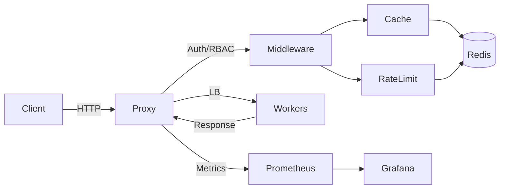

# ⚡ LLMProxy

L7 API Gateway for AI/LLM Traffic Management

## Features

- 🔄 Reverse proxy with connection pooling
- 🧠 Semantic caching (Redis, tenant-isolated)
- 🚦 Token-bucket rate limiting per API key
- ⚖️ Load balancing (round-robin, weighted, least-connections)
- 💓 Active health checking with automatic failover
- 📊 Prometheus + Grafana observability
- 🐳 Docker Compose + Kubernetes ready

## Quick Start

```bash
# Option A: Run locally with Go
export API_KEYS_JSON='{"test-key":{"owner":"local","role":"admin"}}'
go build -o bin/proxy ./cmd/proxy/
go build -o bin/worker ./cmd/worker/

WORKER_PORT=9001 WORKER_ID=worker-1 ./bin/worker &
WORKER_PORT=9002 WORKER_ID=worker-2 ./bin/worker &
WORKER_PORT=9003 WORKER_ID=worker-3 ./bin/worker &

REDIS_ADDR=localhost:6379 ./bin/proxy

# Option B: Docker Compose (add API_KEYS_JSON to docker-compose.yml or .env)
docker-compose up --build -d

# Test it
curl -X POST http://localhost:8080/v1/chat/completions \
  -H "Content-Type: application/json" \
  -H "X-API-Key: test-key" \
  -d '{"model":"gpt-3.5-turbo","messages":[{"role":"user","content":"Hello!"}]}'

# Dashboard
# http://localhost:8080/dashboard

# View metrics
# Prometheus:  http://localhost:9090
# Grafana:     http://localhost:3000  (admin / admin)
```

## Configuration

Copy [.env.example](.env.example) and adjust as needed. The proxy reads env vars directly or a JSON config via `CONFIG_FILE`.

Common env vars:

- `PROXY_PORT` (default: 8080)
- `REDIS_ADDR` (default: localhost:6379)
- `WORKER_1_URL`, `WORKER_2_URL`, `WORKER_3_URL`
- `API_KEYS_JSON` (JSON map of API keys)
- `ENABLE_PER_KEY_METRICS` (set `true` to enable per-key metrics)

Example `API_KEYS_JSON`:

```json
{
  "user-key": {"owner": "alice", "role": "user"},
  "admin-key": {"owner": "ops", "role": "admin"}
}
```

## Observability

- `/metrics` is admin-only and exposes Prometheus metrics.
- `llmproxy_tokens_used_total` emits `prompt`, `completion`, and `total` when backend usage is present; otherwise `completion_estimated`.
- `llmproxy_ratelimit_redis_up` reports rate-limit Redis health.

## Security & Limitations

- API keys are required when auth is enabled; use RBAC to separate user/admin access.
- Semantic cache is syntactic normalization, not true semantic equivalence.
- If backend responses omit `usage`, token metrics fall back to size-based estimates.
- High-cardinality labels are disabled by default (enable only if you understand the Prometheus impact).

## Architecture



## CHANGELOG

- 2026-05: Phase 0–3 hardening and dashboard/RBAC improvements.

## Roadmap

- Improve token usage precision by parsing backend `usage` consistently.
- Add dynamic key storage with Redis TTL support.
- Extend docs with deployment recipes and diagrams.